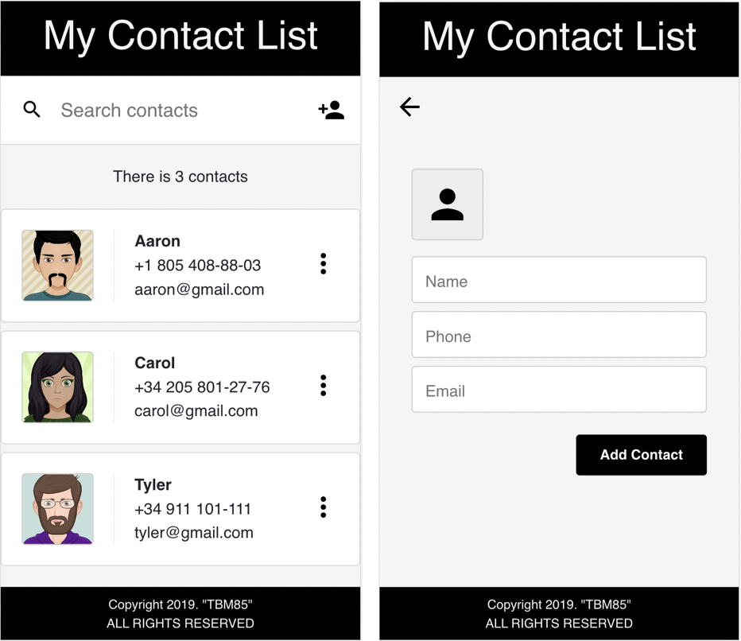

# My Contacts
[Demo](https://tbm85.github.io/Demo-Contact-List/)

## Description
This contact list is a small application created with React JS, performed as a learning exercise in Udacity React Nanodegree. The application allows you to delete, create and search contacts. The React-Router-Dom library is also used to manage navigation.

## Resources
* [Avatar Images](https://avatarmaker.com/)
* [Material Design Icons](https://material.io/resources/icons/)

## How to run this app
* Clone: git clone https://github.com/TBM85/Demo-Contact-List.git
* Enter in the directory: cd Demo-Contact-List
* Install dependencies: npm install
* Start the app: npm start

## License
Copyright (c) 2019 Tania Ballester Marsal. This project is using [MIT License](LICENSE.md)